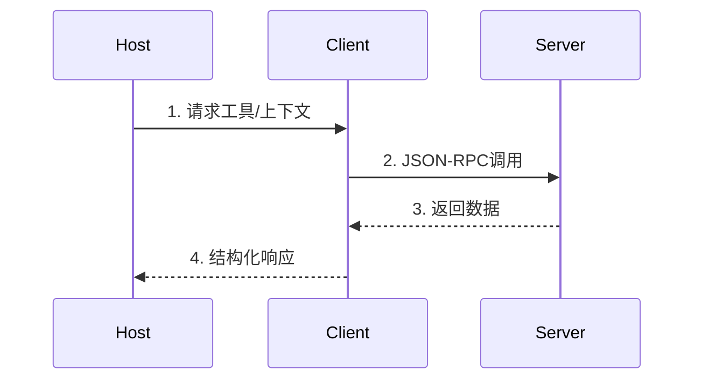
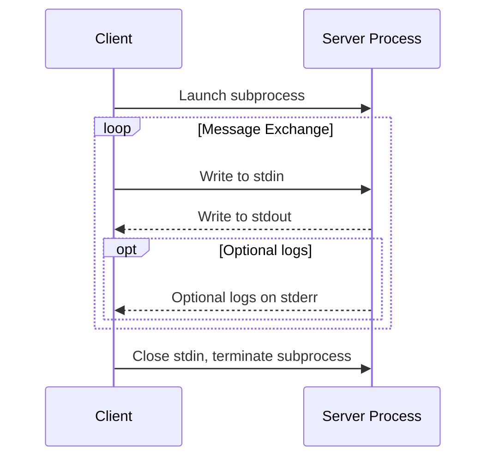

# A. 规范

# 1. 概述

MCP为应用程序提供了一套标准化方案，使其能够：

- 与语言模型共享上下文信息
- 向AI系统开放工具与功能接口
- 构建可组合的集成与工作流

协议采用JSON-RPC 2.0消息格式建立以下组件间的通信：

- 主机（Hosts）：发起连接的LLM应用程序
- 客户端（Clients）：主机应用内部的连接器模块
- 服务端（Servers）：提供上下文与功能的服务

MCP的灵感部分源自语言服务器协议（LSP）——后者通过标准化方案让整个开发生态系统支持多种编程语言。与之类似，MCP通过标准化集成方案，让各类上下文信息与工具能无缝接入AI应用生态系统。



# 2. 核心特性

## 2.1 基础协议

- JSON-RPC 格式的消息
- 有状态的连接
- 服务器和客户端可以协商各自具有什么功能

## 2.2 功能（Features）

服务器可以向客户端提供以下功能（Features） ：

- **Resources（资源）**：供用户或AI模型使用的上下文和数据
    - 客户端可以利用服务器的**Resources**功能索要历史记录、实时数据等
- **Prompts（提示词）**：预定义的模板消息和工作流
    - 用于引导接下来的行为
- **Tools（工具）**：供AI模型执行的函数
    - 客户端可以利用服务器的**Tools**功能调用服务器自定义的工具

客户端可以向服务器提供以下功能（Features）：

- **Sampling（采样）**：服务端发起的代理行为与递归式LLM交互
    - 客户端根据服务器的要求启动的与LLM的交互
    - 因为服务器并没有LLM的密钥，只能通过客户端与LLM交互
- **Roots（根访问）**：服务器发起的对URI或文件系统的边界探查
    - 用户可能要求大模型读取指定文件或者访问网页，服务器可以利用客户端的**Roots**功能读取文件
- **Elicitation（引导）**：服务器发起的，向用户请求额外信息
    - 客户端协助服务器向用户主动索取额外信息，比如服务器发现数据有丢失，服务器可以利用客户端的**Elicitation**功能向用户索取丢失的数据

## 2.3 辅助功能

- 配置管理
- 进度跟踪
- 操作取消
- 错误报告
- 日志记录

# 3. 安全与信任规范

## 3.1 关键原则

- 用户授权与控制
- 数据隐私
- 工具安全
- LLM采样控制

## 3.2 实现指南

# B. 架构-TODO

https://modelcontextprotocol.io/specification/2025-06-18/architecture

# C. 细节
# 基础协议-TODO
## 概述-TODO
模型上下文协议由几个协同工作的关键组件组成：
- 基础协议：核心 JSON-RPC 消息类型
- 生命周期管理：连接初始化、功能协商和会话控制
- 授权：基于 HTTP 传输的身份验证和授权框架
- 服务器功能：服务器公开的资源、提示和工具
- 客户端功能：客户端提供的采样和根目录列表
- 附加程序：横切关注点，例如日志记录和参数补全
所有实现都必须支持基础协议和生命周期管理组件。其他组件可以根据应用程序的具体需求进行实现。
这些协议层建立了清晰的关注点分离，同时支持客户端和服务器之间的丰富交互。模块化设计使实现能够精确支持其所需的功能。
### 1. 消息规范
所有MCP客户端与服务器间的消息必须遵循JSON-RPC 2.0规范，协议定义以下消息类型：
#### 1.1 Request（请求）
```json
{
  "jsonrpc": "2.0",
  "id": "string | number",
  "method": "string",
  "params?": { "[key: string]": "unknown" }
}
```
- 必须包含ID:字符串或数字
- ID不能为空
- 同一会话中ID不得重复使用
#### 1.2 Response（响应）
```json
{
  "jsonrpc": "2.0",
  "id": "string | number",
  "result?": { "[key: string]": "unknown" },
  "error?": {
    "code": "number",
    "message": "string",
    "data?": { "[key: string]": "unknown" }
  }
}
```
- 必须携带与请求对应的ID
- 必须包含result或error之一（不可同时存在）
- result可以遵循任何Json格式，但是error必须包含code和message
- error code必须为整数
#### 1.3 Notification（通知）
```json
{
  "jsonrpc": "2.0",
  "method": "string",
  "params?": { "[key: string]": "unknown" }
}
```
- 不需要ID
### 2. 授权-TODO
### 3. 元数据
[元数据-java实现](./schema.md)
## 生命周期-TODO
## 传输层
MCP 使用 JSON-RPC 2.0 作为其传输格式。传输层负责将 MCP 协议消息转换为 JSON-RPC 格式进行传输，并将接收到的 JSON-RPC 消息转换回 MCP 
协议消息。JSON-RPC 消息必须经过UTF-8编码。

### 1. stdio


### 2. 流式HTTP

#### 2.0.1 安全警告

#### 2.1 客户端向服务器发送消息

- 客户端必须使用HTTP POST请求把json-rpc消息发送到MCP端点
- 客户端发送请求头必须包含Accept字段，并明确声明支持**`application/json`和 `text/event-stream`** 这两种内容类型
- POST请求的请求体必须是一个完整的、独立的 JSON-RPC 请求，通知或响应
- 当客户端向 MCP 服务器发送 JSON-RPC 响应（Response）或通知（Notification）时
    - 如果服务器接收了本次输入，返回202状态码，空body
    - 如果服务器不能接受，返回错误状态码；响应体可选json-rpc错误
- 当客户端向MCP服务器发送JSON-RPC 请求，服务器必须从以下两种响应方式中选择一种返回
    - Content-Type: text/event-stream：初始化一个sse流（持续推送多个事件的长任务）
    - Content-Type: application/json：返回单个json对象
    - 客户端必须同时支持两种类型
- 如果服务器初始化SSE流
    - 服务器**必须**在流中最终返回与客户端原始 POST 请求对应的 JSON-RPC 响应
    - 服务器可以在最终响应前，插入其他 JSON-RPC 消息（如进度更新、中间结果）
    - 在返回最终响应前，服务器**不应**主动关闭流
    - 发送最终响应后，服务器**应**主动关闭 SSE 流
- 连接可能异常断开
    - 网络问题导致的异常断开不应视为客户端请求
    - 客户端需要通过标准通知明确取消请求
    - 服务器要确保流的可恢复性（支持断点续传）

#### 2.2 客户端监听服务器消息

- 客户端可以向MCP端点发送GET请求，这可以用来打开SSE流
- 客户端发送的请求中必须包含**Accept**头，监听**text/event-stream**
- 服务器必须为这个GET请求返回**Content-Type: text/event-stream**或HTTP 405 Method Not Allowed，表示服务器不支持sse流
- 如果服务器初始化了一条SSE流
    - 服务器可以在流上发送json-rpc  request和notification
    - 这些服务器发送的request和notification与来自客户端的request无关
    - 除非恢复与先前客户端请求关联的流，否则服务器不得在该流上发送json-rpc响应
    - 服务器可以随时关闭sse流
    - 客户端可以随时关机sse流

总结2.1跟2.2，POST跟GET通道分离

POST：客户端向服务器发送POST请求 → 服务器返回响应（可以是单个json object，也可以是SSE流）

GET：客户端向服务器发送GET请求 → 服务器初始化SSE流（在这个流中，服务器向客户端发送请求和通知）

GET通道主要是服务器向客户端发送请求和一些通知

#### 2.3 客户端可以监听多个sse流

- 客户端可以与在一台服务器上监听多个SSE流
- 服务器必须将每条json-rpc消息仅发送到其中一个已连接到流
    - 可以通过断点续传降低消息丢失的风险

2.3 主要是说可以把sse流分开，隔离不同类型的消息

#### 2.4 可恢复性和重新投递

为了支持恢复断开的连接并重新投递可能丢失的信息

- 服务器可以将`id` 字段附加在sse流中
    - 该id必须在该会话中的所有流保持全局唯一
- 如果客户端希望在断开连接后恢复连接，则客户端应该向MCP端点发出HTTP GET请求，并包含Last-Event-ID标头以指示其收到的最后一个事件ID
    - 服务器可以使用此标头在断开连接的流上重放最后一个事件ID之后发送的消息，并从该点恢复流
    - 服务器不得重放其他流上的消息

这些事件id应该由服务器根据每个流分配

#### 2.5 会话管理

An MCP “session” consists of logically related interactions between a client and a server, beginning with the [initialization phase](https://modelcontextprotocol.io/specification/2025-06-18/basic/lifecycle). 

为了支持需要建立有状态会话的服务器实现：

- 使用流式HTTP传输的服务器可以在初始化阶段分配会话ID，具体实现方式：在包含InitializeResult的HTTP响应头中添加Mcp-Session-Id字段
    - Mcp-Session-Id应该是全局唯一且安全的（安全生成的UUID、JWT或加密哈希值）
    - Mcp-Session-Id必须包含可见的ASCII字符
- 如果服务器在初始化期间返回了Mcp-Session-Id，则使用流式传输的客户端必须在所有后续HTTP请求头中标识该Mcp-Session-Id
    - 对于没有带Mcp-Session-Id的请求（初始阶段除外），服务器应返回HTTP 400 Bad Request
- 服务器可以随时终止会话，之后必须以 HTTP 404 Not Found 响应包含该会话 ID 的请求
- 当客户端发送了带Mcp-Session-Id的请求但是却收到了HTTP 404 Not Found响应，它必须通过发送不带Mcp-Session-Id 的新 InitializeRequest 来启动新会话
- 如果客户端不再需要某个会话，则应向MCP端点发送包含Mcp-Session-Id 标头的 HTTP DELETE 消息，以明确终止该会话
    - 服务器对于此请求可以响应HTTP 405 Method Not Allowed，表示不允许客户端结束会话

#### 2.6 时序图 TODO

https://modelcontextprotocol.io/specification/2025-06-18/basic/transports#sequence-diagram

#### 2.7 协议版本头

如果使用HTTP协议，客户端必须在HTTP头中带有**MCP-Protocol-Version: <protocol-version>**

例如：**MCP-Protocol-Version: 2025-06-18**

客户端发送的协议版本应是初始化阶段协商的版本

向后兼容性

- 如果服务器 **未收到** `MCP-Protocol-Version`头，且无法通过其他方式（如初始化协商的版本）识别协议版本，则服务器 **应（SHOULD）** 默认使用协议版本 `2025-03-26`。
- 如果服务器收到的请求包含 **无效或不支持** 的 `MCP-Protocol-Version`，则 **必须（MUST）** 返回 `400 Bad Request`错误

#### 2.8 向后兼容性

客户端和服务端可通过以下方式保持与旧版**HTTP+SSE传输协议**（protocol version 2024-11-05）的兼容性

- 服务器兼容旧客户端
    - **继续同时托管旧版SSE和POST端点**，与新版Streamable HTTP传输协议的**MCP端点**并存
        - 也可将旧版POST端点与新版MCP端点合并，但可能引入不必要的复杂性
- 客户端兼容旧服务器
    - **接收MCP服务端URL**（可能指向旧版或新版协议的服务端）
    - **尝试向该URL发送InitializeRequest（POST请求）**，并携带规定的`Accept`头部：
        - **若成功** → 判定为支持新版Streamable HTTP传输的服务端。
        - **若返回HTTP 4xx状态码**（如`405 Method Not Allowed`或`404 Not Found`）：
            - 改为发起**GET请求**到该URL，预期将开启SSE流并返回`endpoint`事件作为首个事件。
            - 收到`endpoint`事件后 → 判定为旧版HTTP+SSE传输的服务端，后续所有通信均使用旧协议

### 3. 授权
### 4. 最佳安全实践
### 5. 辅助功能
#### 5.1 取消（Cancellation）
#### 5.2 Ping
#### 5.3 进度（Progress）

## 客户端功能（Client Features）
### roots
模型上下文协议（MCP）为客户端向服务端暴露文件系统"根目录"提供了标准化方案。根目录定义了服务端可操作的文件系统边界，
使其明确可访问的目录和文件范围。支持该特性的客户端会响应服务端的根目录列表请求，并在列表变更时主动推送通知。
#### 1. 用户交互模型
根目录通常通过工作区或项目配置界面暴露，例如：
- 提供工作区/项目选择器，允许用户指定服务端可访问的目录
- 结合版本控制系统或项目文件自动检测工作区
#### 2 能力
客户端如果支持根目录功能，必须在初始化阶段声明其支持的根目录功能：
```json
{
  "capabilities": {
    "roots": {
      "listChanged": true
    }
  }
}
```
`listChanged`表示客户端是否支持根目录变更通知（当根目录发生改变时，通知服务器）
#### 3 协议消息
##### 3.1 获取根目录列表
服务器向客户端发送roots/list请求，获取根目录
```json
{
  "jsonrpc": "2.0",
  "id": 1,
  "method": "roots/list"
}
```

客户端向服务器返回Response
```json
{
  "jsonrpc": "2.0",
  "id": 1,
  "result": {
    "roots": [
      {
        "uri": "file:///home/user/projects/myproject",
        "name": "My Project"
      }
    ]
  }
}
```

##### 3.2 根目录变更通知
当根目录发生变化时，支持`listChanged`的客户端应向服务器发送通知：
```json
{
  "jsonrpc": "2.0",
  "method": "notifications/roots/list_changed"
}
```
#### 4.消息流
#### 5.数据类型
##### 5.1 根目录定义
“根”定义包括
- uri: 独一无二的root标识，（在2025-06-18规范下）必须以file://开头
- name: 可选的根目录名称，用于用户界面展示
###### 5.1.1 单项目目录
```json
{
  "uri": "file:///home/user/projects/myproject",
  "name": "My Project"
}
```
###### 5.1.2 多模块项目目录
```json
[
  {
    "uri": "file:///home/user/repos/frontend",
    "name": "Frontend Repository"
  },
  {
    "uri": "file:///home/user/repos/backend",
    "name": "Backend Repository"
  }
]
```
#### 6.错误处理
客户端应该返回标准的JSON-RPC错误
- 客户端不支持根目录提供能力：-32601（Method not found）
- 内部错误：-32063
例如：
```json
{
  "jsonrpc": "2.0",
  "id": 1,
  "error": {
    "code": -32601,
    "message": "Roots not supported",
    "data": {
      "reason": "Client does not have roots capability"
    }
  }
}
```
#### 7.安全性
客户端必须
- 仅暴露具有合法权限的根目录
- 校验所有URI防止路径遍历攻击
- 实施访问控制策略
- 监控根目录可访问性
服务器应该
- 处理根目录不可用的情况
- 在操作中严格遵循目录边界
- 根据提供的根目录校验所有路径
#### 实现指南
客户端建议
- 暴露根目录前需获得用户确认
- 提供直观的根目录管理界面
- 预先校验目录可访问性
- 监控根目录变更
服务器建议
- 使用前检查roots能力声明
- 优雅处理根目录列表变更
- 在操作中尊重目录边界
- 合理缓存根目录信息
## 服务器功能（Server Features）- TODO 修改标题层级
### 概述
服务器通过模型上下文协议（MCP）为语言模型增添上下文提供了基本构建块。这些基本元素支持客户端、服务器和语言模型之间的丰富交互：
- 提示词（Prompts）：预定义的模板或指令，用于指导语言模型的交互
- 资源（Resources）：为模型提供额外上下文的结构化数据或内容
- 工具（Tools）：可执行的函数，让模型能够执行操作或检索信息

每种基本元素可通过以下控制层级进行概述：

| 基本元素 | 控制方式   | 描述               | 示例              |
|------|--------|------------------|-----------------|
| 提示词  | 用户控制   | 由用户选择调用的交互式模板    | 斜杠命令、菜单选项       |
| 资源   | 应用程序控制 | 由客户端附加和管理的上下文数据  | 文件内容、git历史记录    |
| 工具   | 模型控制   | 向LLM开放的用于执行操作的函数 | API POST请求、文件写入 |

### Prompts
模型上下文协议（MCP）为服务器向客户端暴露提示词模板提供了标准化方式。提示词让服务器能够提供结构化消息和指令，用于与语言模型交互。
客户端可以发现可用的提示词、获取其内容，并通过提供参数对其进行自定义。


#### 1. 用户交互模式
提示词设计为**用户控制**模式，即服务器向客户端暴露提示词时，旨在让用户能够明确选择使用。
通常，提示词通过用户在界面中主动发起的命令触发，这种方式便于用户自然地发现和调用可用的提示词。


### 功能声明
支持提示词功能的服务器**必须**在初始化时声明`prompts`能力：
```json
{
  "capabilities": {
    "prompts": {
      "listChanged": true
    }
  }
}
```
其中，`listChanged`表示当可用提示词列表发生变化时，服务器是否会发送通知。


### 协议消息
#### 列出提示词
客户端如需获取可用提示词，需发送`prompts/list`请求。此操作支持分页。

**请求示例**：
```json
{
  "jsonrpc": "2.0",
  "id": 1,
  "method": "prompts/list",
  "params": {
    "cursor": "optional-cursor-value"  // 可选的分页游标
  }
}
```

**响应示例**：
```json
{
  "jsonrpc": "2.0",
  "id": 1,
  "result": {
    "prompts": [
      {
        "name": "code_review",  // 提示词唯一标识
        "title": "请求代码审查",  // 用于展示的名称（可选）
        "description": "让大语言模型分析代码质量并提出改进建议",  // 描述（可选）
        "arguments": [  // 自定义参数列表（可选）
          {
            "name": "code",  // 参数名
            "description": "需要审查的代码",  // 参数描述
            "required": true  // 是否为必填参数
          }
        ]
      }
    ],
    "nextCursor": "next-page-cursor"  // 下一页游标（用于分页）
  }
}
```


#### 获取特定提示词
客户端如需获取某个特定提示词，需发送`prompts/get`请求。参数可通过补全API自动补全。

**请求示例**：
```json
{
  "jsonrpc": "2.0",
  "id": 2,
  "method": "prompts/get",
  "params": {
    "name": "code_review",  // 目标提示词的唯一标识
    "arguments": {  // 传入的参数
      "code": "def hello():\n    print('world')"
    }
  }
}
```

**响应示例**：
```json
{
  "jsonrpc": "2.0",
  "id": 2,
  "result": {
    "description": "代码审查提示词",  // 提示词描述
    "messages": [  // 提示词包含的消息列表
      {
        "role": "user",  // 角色（用户或助手）
        "content": {
          "type": "text",  // 内容类型
          "text": "请审查这段Python代码：\ndef hello():\n    print('world')"  // 具体内容
        }
      }
    ]
  }
}
```


#### 列表变更通知
当可用提示词列表发生变化时，已声明`listChanged`能力的服务器**应**发送如下通知：
```json
{
  "jsonrpc": "2.0",
  "method": "notifications/prompts/list_changed"
}
```


### 消息流程
```
服务器 ←→ 客户端
        （发现阶段）
服务器 → 客户端：提示词列表（通过prompts/list请求触发）
服务器 ←→ 客户端
        （使用阶段）
服务器 → 客户端：特定提示词内容（通过prompts/get请求触发）
服务器 ←→ 客户端
        （变更阶段，可选，基于listChanged能力）
服务器 → 客户端：提示词列表变更通知（notifications/prompts/list_changed）
服务器 → 客户端：更新后的提示词列表（通过prompts/list请求触发）
```


### 数据类型
#### 提示词（Prompt）
提示词定义包含以下字段：
- `name`：提示词的唯一标识符
- `title`：可选，用于展示的人类可读名称
- `description`：可选，人类可读的描述文本
- `arguments`：可选，用于自定义的参数列表


#### 提示词消息（PromptMessage）
提示词中的消息包含以下字段：
- `role`：角色，值为“user”（用户）或“assistant”（助手），用于标识发言者
- `content`：内容，支持以下类型：

  1. **文本内容（Text Content）**  
     表示纯文本消息：
     ```json
     {
       "type": "text",
       "text": "消息的文本内容"
     }
     ```
     这是自然语言交互中最常用的内容类型。

  2. **图片内容（Image Content）**  
     允许在消息中包含视觉信息：
     ```json
     {
       "type": "image",
       "data": "base64编码的图片数据",
       "mimeType": "image/png"  // 图片的MIME类型
     }
     ```
     图片数据**必须**经过base64编码，并包含有效的MIME类型。这支持需要视觉上下文的多模态交互。

  3. **音频内容（Audio Content）**  
     允许在消息中包含音频信息：
     ```json
     {
       "type": "audio",
       "data": "base64编码的音频数据",
       "mimeType": "audio/wav"  // 音频的MIME类型
     }
     ```
     音频数据**必须**经过base64编码，并包含有效的MIME类型。这支持需要音频上下文的多模态交互。

  4. **嵌入式资源（Embedded Resources）**  
     允许在消息中直接引用服务器端资源：
     ```json
     {
       "type": "resource",
       "resource": {
         "uri": "resource://example",  // 资源的URI
         "name": "example",  // 资源名称
         "title": "我的示例资源",  // 资源标题
         "mimeType": "text/plain",  // 资源的MIME类型
         "text": "资源内容"  // 资源的文本内容
       }
     }
     ```
     资源可包含文本或二进制（blob）数据，且**必须**包含：
    - 有效的资源URI
    - 对应的MIME类型
    - 文本内容或base64编码的二进制数据

     嵌入式资源使提示词能够将服务器管理的内容（如文档、代码示例或其他参考资料）无缝整合到对话流程中。


### 错误处理
服务器**应**针对常见失败场景返回标准JSON-RPC错误：
- 无效的提示词名称：`-32602`（无效参数）
- 缺少必填参数：`-32602`（无效参数）
- 内部错误：`-32603`（内部错误）


### 实现注意事项
- 服务器**应**在处理前验证提示词参数
- 客户端**应**处理大型提示词列表的分页逻辑
- 双方**应**遵守能力协商机制


### 安全性
实现时**必须**仔细验证所有提示词的输入和输出，以防止注入攻击或未授权访问资源。


本页内容：
用户交互模式、功能声明、协议消息、列出提示词、获取特定提示词、列表变更通知、消息流程、数据类型、提示词、提示词消息、文本内容、图片内容、音频内容、嵌入式资源、错误处理、实现注意事项、安全性
