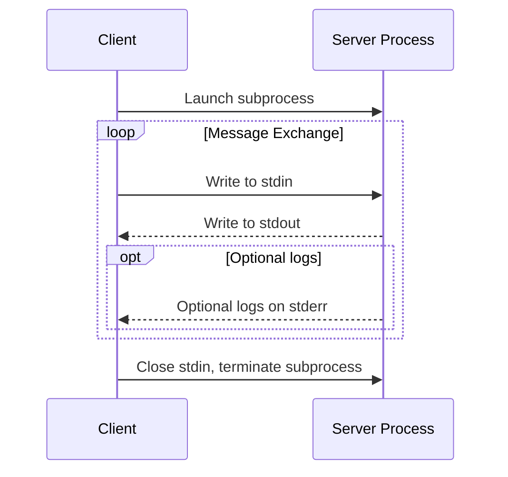

> 概述

模型上下文协议由几个协同工作的关键组件组成：
- 基础协议：核心 JSON-RPC 消息类型
- 生命周期管理：连接初始化、功能协商和会话控制
- 授权：基于 HTTP 传输的身份验证和授权框架
- 服务器功能：服务器公开的资源、提示和工具
- 客户端功能：客户端提供的采样和根目录列表
- 附加程序：横切关注点，例如日志记录和参数补全
  所有实现都必须支持基础协议和生命周期管理组件。其他组件可以根据应用程序的具体需求进行实现。
  这些协议层建立了清晰的关注点分离，同时支持客户端和服务器之间的丰富交互。模块化设计使实现能够精确支持其所需的功能。
# 1. 消息规范
所有MCP客户端与服务器间的消息必须遵循JSON-RPC 2.0规范，协议定义以下消息类型：
## 1.1 Request（请求）
```json
{
  "jsonrpc": "2.0",
  "id": "string | number",
  "method": "string",
  "params?": { "[key: string]": "unknown" }
}
```
- 必须包含ID:字符串或数字
- ID不能为空
- 同一会话中ID不得重复使用
## 1.2 Response（响应）
```json
{
  "jsonrpc": "2.0",
  "id": "string | number",
  "result?": { "[key: string]": "unknown" },
  "error?": {
    "code": "number",
    "message": "string",
    "data?": { "[key: string]": "unknown" }
  }
}
```
- 必须携带与请求对应的ID
- 必须包含result或error之一（不可同时存在）
- result可以遵循任何Json格式，但是error必须包含code和message
- error code必须为整数
## 1.3 Notification（通知）
```json
{
  "jsonrpc": "2.0",
  "method": "string",
  "params?": { "[key: string]": "unknown" }
}
```
- 不需要ID
# 2. 授权-TODO
# 3. 基础数据结构
[基础数据结构-java实现](../mcp_schema.md)
--- 
# 生命周期-TODO
---
# 传输层
MCP 使用 JSON-RPC 2.0 作为其传输格式。传输层负责将 MCP 协议消息转换为 JSON-RPC 格式进行传输，并将接收到的 JSON-RPC 消息转换回 MCP
协议消息。JSON-RPC 消息必须经过UTF-8编码。

# 1. stdio


# 2. 流式HTTP

## 2.0.1 安全警告

## 2.1 客户端向服务器发送消息

- 客户端必须使用HTTP POST请求把json-rpc消息发送到MCP端点
- 客户端发送请求头必须包含Accept字段，并明确声明支持**`application/json`和 `text/event-stream`** 这两种内容类型
- POST请求的请求体必须是一个完整的、独立的 JSON-RPC 请求，通知或响应
- 当客户端向 MCP 服务器发送 JSON-RPC 响应（Response）或通知（Notification）时
    - 如果服务器接收了本次输入，返回202状态码，空body
    - 如果服务器不能接受，返回错误状态码；响应体可选json-rpc错误
- 当客户端向MCP服务器发送JSON-RPC 请求，服务器必须从以下两种响应方式中选择一种返回
    - Content-Type: text/event-stream：初始化一个sse流（持续推送多个事件的长任务）
    - Content-Type: application/json：返回单个json对象
    - 客户端必须同时支持两种类型
- 如果服务器初始化SSE流
    - 服务器**必须**在流中最终返回与客户端原始 POST 请求对应的 JSON-RPC 响应
    - 服务器可以在最终响应前，插入其他 JSON-RPC 消息（如进度更新、中间结果）
    - 在返回最终响应前，服务器**不应**主动关闭流
    - 发送最终响应后，服务器**应**主动关闭 SSE 流
- 连接可能异常断开
    - 网络问题导致的异常断开不应视为客户端请求
    - 客户端需要通过标准通知明确取消请求
    - 服务器要确保流的可恢复性（支持断点续传）

## 2.2 客户端监听服务器消息

- 客户端可以向MCP端点发送GET请求，这可以用来打开SSE流
- 客户端发送的请求中必须包含**Accept**头，监听**text/event-stream**
- 服务器必须为这个GET请求返回**Content-Type: text/event-stream**或HTTP 405 Method Not Allowed，表示服务器不支持sse流
- 如果服务器初始化了一条SSE流
    - 服务器可以在流上发送json-rpc  request和notification
    - 这些服务器发送的request和notification与来自客户端的request无关
    - 除非恢复与先前客户端请求关联的流，否则服务器不得在该流上发送json-rpc响应
    - 服务器可以随时关闭sse流
    - 客户端可以随时关机sse流

总结2.1跟2.2，POST跟GET通道分离

POST：客户端向服务器发送POST请求 → 服务器返回响应（可以是单个json object，也可以是SSE流）

GET：客户端向服务器发送GET请求 → 服务器初始化SSE流（在这个流中，服务器向客户端发送请求和通知）

GET通道主要是服务器向客户端发送请求和一些通知

## 2.3 客户端可以监听多个sse流

- 客户端可以与在一台服务器上监听多个SSE流
- 服务器必须将每条json-rpc消息仅发送到其中一个已连接到流
    - 可以通过断点续传降低消息丢失的风险

2.3 主要是说可以把sse流分开，隔离不同类型的消息

## 2.4 可恢复性和重新投递

为了支持恢复断开的连接并重新投递可能丢失的信息

- 服务器可以将`id` 字段附加在sse流中
    - 该id必须在该会话中的所有流保持全局唯一
- 如果客户端希望在断开连接后恢复连接，则客户端应该向MCP端点发出HTTP GET请求，并包含Last-Event-ID标头以指示其收到的最后一个事件ID
    - 服务器可以使用此标头在断开连接的流上重放最后一个事件ID之后发送的消息，并从该点恢复流
    - 服务器不得重放其他流上的消息

这些事件id应该由服务器根据每个流分配

## 2.5 会话管理

An MCP “session” consists of logically related interactions between a client and a server, beginning with the [initialization phase](https://modelcontextprotocol.io/specification/2025-06-18/basic/lifecycle). 

为了支持需要建立有状态会话的服务器实现：

- 使用流式HTTP传输的服务器可以在初始化阶段分配会话ID，具体实现方式：在包含InitializeResult的HTTP响应头中添加Mcp-Session-Id字段
    - Mcp-Session-Id应该是全局唯一且安全的（安全生成的UUID、JWT或加密哈希值）
    - Mcp-Session-Id必须包含可见的ASCII字符
- 如果服务器在初始化期间返回了Mcp-Session-Id，则使用流式传输的客户端必须在所有后续HTTP请求头中标识该Mcp-Session-Id
    - 对于没有带Mcp-Session-Id的请求（初始阶段除外），服务器应返回HTTP 400 Bad Request
- 服务器可以随时终止会话，之后必须以 HTTP 404 Not Found 响应包含该会话 ID 的请求
- 当客户端发送了带Mcp-Session-Id的请求但是却收到了HTTP 404 Not Found响应，它必须通过发送不带Mcp-Session-Id 的新 InitializeRequest 来启动新会话
- 如果客户端不再需要某个会话，则应向MCP端点发送包含Mcp-Session-Id 标头的 HTTP DELETE 消息，以明确终止该会话
    - 服务器对于此请求可以响应HTTP 405 Method Not Allowed，表示不允许客户端结束会话

## 2.6 时序图 TODO

https://modelcontextprotocol.io/specification/2025-06-18/basic/transports#sequence-diagram

## 2.7 协议版本头

如果使用HTTP协议，客户端必须在HTTP头中带有**MCP-Protocol-Version: <protocol-version>**

例如：**MCP-Protocol-Version: 2025-06-18**

客户端发送的协议版本应是初始化阶段协商的版本

向后兼容性

- 如果服务器 **未收到** `MCP-Protocol-Version`头，且无法通过其他方式（如初始化协商的版本）识别协议版本，则服务器 **应（SHOULD）** 默认使用协议版本 `2025-03-26`。
- 如果服务器收到的请求包含 **无效或不支持** 的 `MCP-Protocol-Version`，则 **必须（MUST）** 返回 `400 Bad Request`错误

## 2.8 向后兼容性

客户端和服务端可通过以下方式保持与旧版**HTTP+SSE传输协议**（protocol version 2024-11-05）的兼容性

- 服务器兼容旧客户端
    - **继续同时托管旧版SSE和POST端点**，与新版Streamable HTTP传输协议的**MCP端点**并存
        - 也可将旧版POST端点与新版MCP端点合并，但可能引入不必要的复杂性
- 客户端兼容旧服务器
    - **接收MCP服务端URL**（可能指向旧版或新版协议的服务端）
    - **尝试向该URL发送InitializeRequest（POST请求）**，并携带规定的`Accept`头部：
        - **若成功** → 判定为支持新版Streamable HTTP传输的服务端。
        - **若返回HTTP 4xx状态码**（如`405 Method Not Allowed`或`404 Not Found`）：
            - 改为发起**GET请求**到该URL，预期将开启SSE流并返回`endpoint`事件作为首个事件。
            - 收到`endpoint`事件后 → 判定为旧版HTTP+SSE传输的服务端，后续所有通信均使用旧协议
---
# 授权
TODO

---
# 最佳安全实践
TODO

---
# 辅助功能
> 取消（Cancellation）

TODO
> Ping

TODO
> 进度（Progress）

TODO

---