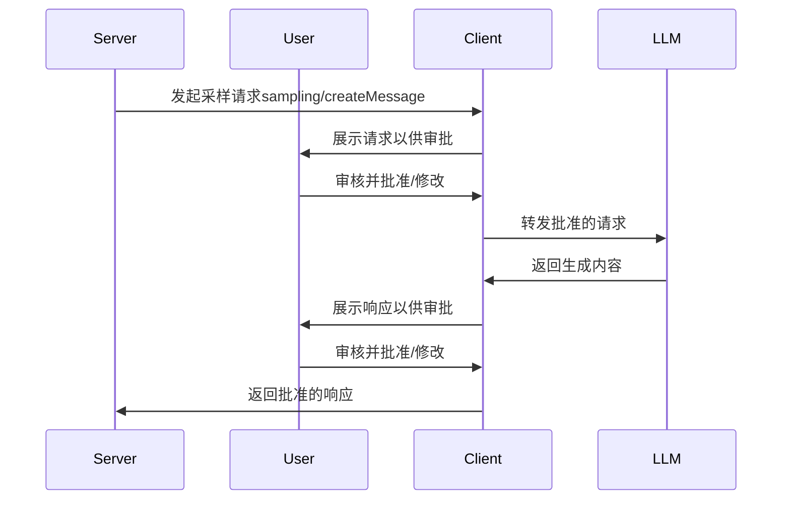

> roots

模型上下文协议（MCP）为客户端向服务端暴露文件系统"根目录"提供了标准化方案。根目录定义了服务端可操作的文件系统边界，
使其明确可访问的目录和文件范围。支持该特性的客户端会响应服务端的根目录列表请求，并在列表变更时主动推送通知。
# 1. 用户交互模型
根目录通常通过工作区或项目配置界面暴露，例如：
- 提供工作区/项目选择器，允许用户指定服务端可访问的目录
- 结合版本控制系统或项目文件自动检测工作区
# 2. 能力
客户端如果支持根目录功能，必须在初始化阶段声明其支持的根目录功能：
```json
{
  "capabilities": {
    "roots": {
      "listChanged": true
    }
  }
}
```
`listChanged`表示客户端是否支持根目录变更通知（当根目录发生改变时，通知服务器）
# 3. 协议消息
## 3.1 获取根目录列表
服务器向客户端发送roots/list请求，获取根目录
```json
{
  "jsonrpc": "2.0",
  "id": 1,
  "method": "roots/list"
}
```

客户端向服务器返回Response
```json
{
  "jsonrpc": "2.0",
  "id": 1,
  "result": {
    "roots": [
      {
        "uri": "file:///home/user/projects/myproject",
        "name": "My Project"
      }
    ]
  }
}
```

## 3.2 根目录变更通知
当根目录发生变化时，支持`listChanged`的客户端应向服务器发送通知：
```json
{
  "jsonrpc": "2.0",
  "method": "notifications/roots/list_changed"
}
```
# 4.消息流
# 5.数据类型
## 5.1 根目录定义
“根”定义包括
- uri: 独一无二的root标识，（在2025-06-18规范下）必须以file://开头
- name: 可选的根目录名称，用于用户界面展示
### 5.1.1 单项目目录
```json
{
  "uri": "file:///home/user/projects/myproject",
  "name": "My Project"
}
```
### 5.1.2 多模块项目目录
```json
[
  {
    "uri": "file:///home/user/repos/frontend",
    "name": "Frontend Repository"
  },
  {
    "uri": "file:///home/user/repos/backend",
    "name": "Backend Repository"
  }
]
```
# 6.错误处理
客户端应该返回标准的JSON-RPC错误
- 客户端不支持根目录提供能力：-32601（Method not found）
- 内部错误：-32063
  例如：
```json
{
  "jsonrpc": "2.0",
  "id": 1,
  "error": {
    "code": -32601,
    "message": "Roots not supported",
    "data": {
      "reason": "Client does not have roots capability"
    }
  }
}
```
# 7.安全性
客户端必须
- 仅暴露具有合法权限的根目录
- 校验所有URI防止路径遍历攻击
- 实施访问控制策略
- 监控根目录可访问性
  服务器应该
- 处理根目录不可用的情况
- 在操作中严格遵循目录边界
- 根据提供的根目录校验所有路径
# 8.实现指南
客户端建议
- 暴露根目录前需获得用户确认
- 提供直观的根目录管理界面
- 预先校验目录可访问性
- 监控根目录变更
  服务器建议
- 使用前检查roots能力声明
- 优雅处理根目录列表变更
- 在操作中尊重目录边界
- 合理缓存根目录信息

---

> Sampling

模型上下文协议（MCP）为服务器提供了一种标准化的方式，使其能够通过客户端向语言模型请求大语言模型采样（即 “补全” 或 “生成”）。
这种流程让客户端能够控制模型访问、选择和权限，同时使服务器得以利用人工智能能力，且服务器无需使用 API 密钥。服务器可以请求基于文本、
音频或图像的交互，还可以选择在提示词中融入来自 MCP 服务器的上下文信息。

# 1. 用户交互模型
MCP 中的采样功能支持服务器实现智能行为，允许在其他 MCP 服务器功能中嵌套调用大语言模型。

开发者可以根据自身需求，自由选择通过任何界面模式来实现采样功能，协议本身并未规定特定的用户交互模型。

出于信任安全的考虑，采样请求过程中应始终有人参与，具备拒绝采样请求的能力。

应用程序应做到：
- 提供易于直观查看和审核采样请求的用户界面。
- 允许用户在发送请求前查看并编辑提示词。
- 在交付前展示生成的回复供用户审核。

# 2. 功能声明
支持采样功能的客户端必须在初始化时声明sampling功能
```json
{
  "capabilities": {
    "sampling": {}
  }
}
```
# 3. 协议消息
## 3.1 创建消息
服务器若要请求语言模型生成内容，需发送sampling/createMessage请求
- Request
```json
{
  "jsonrpc": "2.0",
  "id": 1,
  "method": "sampling/createMessage",
  "params": {
    "messages": [
      {
        "role": "user",
        "content": {
          "type": "text",
          "text": "What is the capital of France?"
        }
      }
    ],
    "modelPreferences": {
      "hints": [
        {
          "name": "claude-3-sonnet"
        }
      ],
      "intelligencePriority": 0.8,
      "speedPriority": 0.5
    },
    "systemPrompt": "You are a helpful assistant.",
    "maxTokens": 100
  }
}
```
- Response
```json
{
  "jsonrpc": "2.0",
  "id": 1,
  "result": {
    "role": "assistant",
    "content": {
      "type": "text",
      "text": "The capital of France is Paris."
    },
    "model": "claude-3-sonnet-20240307",
    "stopReason": "endTurn"
  }
}
```
# 4. 消息流

# 5. 数据类型

# 6. 错误处理

# 7. 安全性

