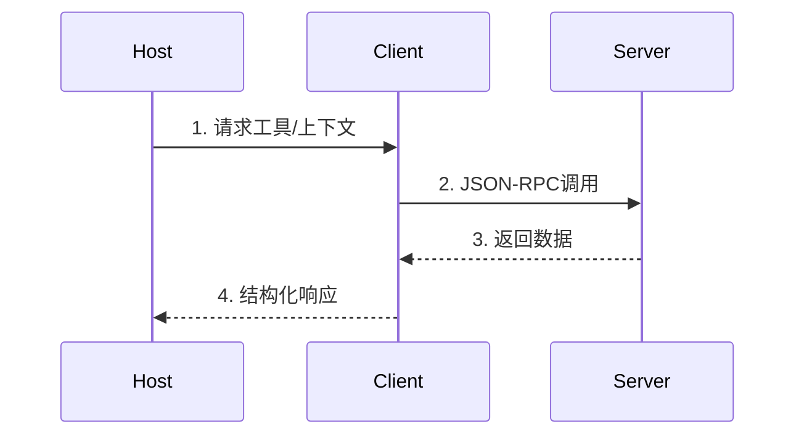

> 规范
# 1. 概述

MCP为应用程序提供了一套标准化方案，使其能够：

- 与语言模型共享上下文信息
- 向AI系统开放工具与功能接口
- 构建可组合的集成与工作流

协议采用JSON-RPC 2.0消息格式建立以下组件间的通信：

- 主机（Hosts）：发起连接的LLM应用程序
- 客户端（Clients）：主机应用内部的连接器模块
- 服务端（Servers）：提供上下文与功能的服务

MCP的灵感部分源自语言服务器协议（LSP）——后者通过标准化方案让整个开发生态系统支持多种编程语言。与之类似，MCP通过标准化集成方案，让各类上下文信息与工具能无缝接入AI应用生态系统。

# 2. 核心特性

## 2.1 基础协议

- JSON-RPC 格式的消息
- 有状态的连接
- 服务器和客户端可以协商各自具有什么功能

## 2.2 功能（Features）

服务器可以向客户端提供以下功能（Features） ：

- **Resources（资源）**：供用户或AI模型使用的上下文和数据
    - 客户端可以利用服务器的**Resources**功能索要历史记录、实时数据等
- **Prompts（提示词）**：预定义的模板消息和工作流
    - 用于引导接下来的行为
- **Tools（工具）**：供AI模型执行的函数
    - 客户端可以利用服务器的**Tools**功能调用服务器自定义的工具

客户端可以向服务器提供以下功能（Features）：

- **Sampling（采样）**：服务端发起的代理行为与递归式LLM交互
    - 客户端根据服务器的要求启动的与LLM的交互
    - 因为服务器并没有LLM的密钥，只能通过客户端与LLM交互
- **Roots（根访问）**：服务器发起的对URI或文件系统的边界探查
    - 用户可能要求大模型读取指定文件或者访问网页，服务器可以利用客户端的**Roots**功能读取文件
- **Elicitation（引导）**：服务器发起的，向用户请求额外信息
    - 客户端协助服务器向用户主动索取额外信息，比如服务器发现数据有丢失，服务器可以利用客户端的**Elicitation**功能向用户索取丢失的数据

## 2.3 辅助功能

- 配置管理
- 进度跟踪
- 操作取消
- 错误报告
- 日志记录

# 3. 安全与信任规范

## 3.1 关键原则

- 用户授权与控制
- 数据隐私
- 工具安全
- LLM采样控制

## 3.2 实现指南

